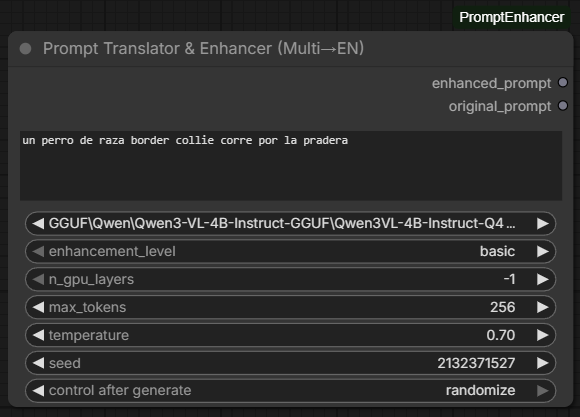
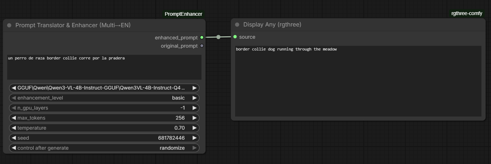
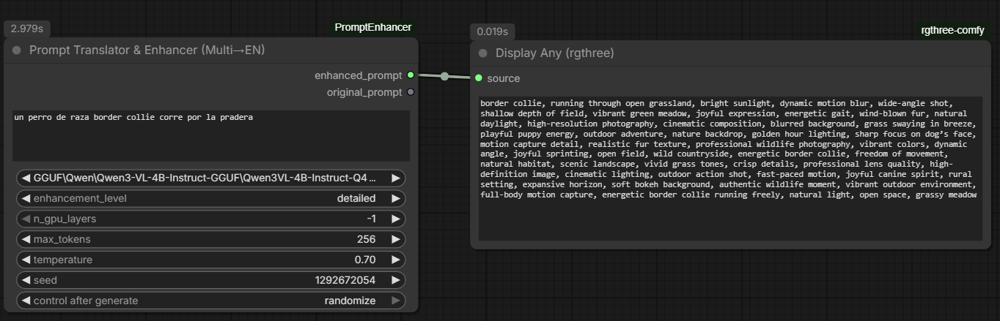
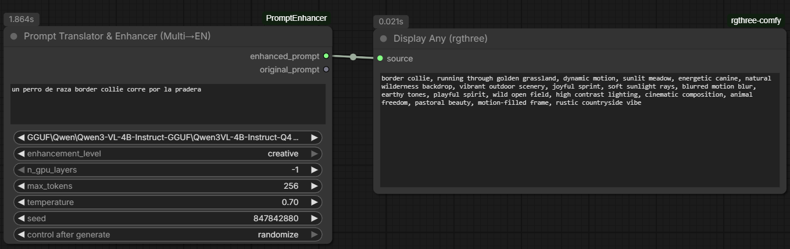

# ComfyUI-PromptTranslator-Enhancer
**Autor**: EzeTojo | **Versión**: 1.0.0

Custom node para ComfyUI que traduce y mejora prompts desde distintos idiomas al inglés usando un modelo de lenguaje local (GGUF). Los idiomas soportados dependen exclusivamente del modelo que elijas usar.

## Características

- 🌐 **Multi-idioma**: Traduce automáticamente desde los idiomas soportados por el modelo al inglés
- ✨ **Mejora de prompts** con 3 niveles: basic, detailed, creative
- 🖥️ **100% local** — usa modelos GGUF vía `llama-cpp-python`
- 🔄 **Modelo reutilizable** — carga una vez, usa en múltiples nodos
- 🛡️ **Carga robusta** — fallback automático GPU → CPU con gestión inteligente de VRAM
- 🚫 **Filtro de modelos VL** — excluye automáticamente modelos Vision-Language no compatibles

## Ejemplos en acción

Aquí tienes cómo se ve el nodo en ComfyUI en sus diferentes estados:

### Nodo Vacío


### Traducción Básica (Basic)


### Traducción y Mejora Detallada (Detailed)


### Mejora Creativa (Creative)


## Nodos incluidos

| Nodo | Descripción |
|------|-------------|
| **Load LLM Model (GGUF)** | Carga un modelo GGUF en memoria para reutilizar |
| **Prompt Translator & Enhancer (Multi→EN)** | Todo-en-uno: carga modelo, traduce y mejora |
| **Prompt Translator & Enhancer From Model (Multi→EN)** | Usa un modelo ya cargado para traducir y mejorar |

## Instalación

1. Clonar o copiar este directorio en `ComfyUI/custom_nodes/comfyui-prompt-translator-enhancer/`
2. Instalar dependencias:
   ```bash
   pip install llama-cpp-python
   ```
   Para soporte GPU (CUDA):
   ```bash
   CMAKE_ARGS="-DGGML_CUDA=on" pip install llama-cpp-python --force-reinstall --no-cache-dir
   ```
3. Colocar modelos GGUF en `ComfyUI/models/LLM/` (subdirectorios permitidos)

## Modelos recomendados

> **IMPORTANTE**: Usa modelos **Instruct** o **Chat** (que suelen tener "Instruct" o "Chat" en su nombre). Los modelos Vision-Language (VL) como `Qwen3VL`, `LLaVA`, etc. **no son compatibles** con este nodo y serán filtrados automáticamente de la lista.

- **Qwen3-4B-Instruct-Q4_K_M.gguf** (~2.5 GB) — Buen balance velocidad/calidad, excelente soporte multi-idioma.
- **Qwen2.5-3B-Instruct-Q4_K_M.gguf** (~2 GB) — Más ligero.
- **Phi-3-mini-4k-instruct-Q4_K_M.gguf** (~2.3 GB) — Alternativa sólida.

## Gestión de VRAM

Este nodo está diseñado para funcionar dentro de ComfyUI, donde la GPU suele estar ocupada con modelos de difusión. La estrategia de carga es:

1. **Intenta GPU** con el contexto solicitado, luego con contextos más pequeños (2048, 512)
2. **Libera cache VRAM** de PyTorch antes de cada intento (`torch.cuda.empty_cache()`)
3. **Fallback CPU puro** — si la GPU no tiene VRAM suficiente, carga el modelo 100% en CPU sin usar CUDA para compute, KQV offload, ni Flash Attention. Esto garantiza que funcione sin importar cuánta VRAM esté ocupada.

> El modo CPU es más lento pero siempre funcional. Para mejor rendimiento, descarga otros modelos de la GPU antes de ejecutar el nodo.

## Uso

### Opción 1: Todo-en-uno
```
[Prompt Translator & Enhancer (Multi→EN)] → [CLIP Text Encode] → [KSampler]
```

### Opción 2: Modelo reutilizable
```
[Load LLM Model] → [Prompt Translator & Enhancer From Model (Multi→EN)] → [CLIP Text Encode] → [KSampler]
```

### Niveles de mejora

- **basic**: Traduce y añade tags mínimos de calidad
- **detailed**: Traduce y añade iluminación, composición, calidad
- **creative**: Traduce con interpretación artística, estilos, efectos

## Changelog

### v1.0.0
- ✅ Carga robusta con fallback automático GPU → CPU
- ✅ Gestión inteligente de VRAM (libera cache de PyTorch)
- ✅ Modo CPU puro: `op_offload=False`, `flash_attn=disabled`, `offload_kqv=False`
- ✅ Filtro automático de modelos Vision-Language (VL)
- ✅ Registro proactivo de DLLs CUDA para Windows
- ✅ Verbose mode siempre activo para diagnóstico
- ✅ Soporte para prompts en cualquier idioma (depende del modelo)

### v0.0.1
- Versión inicial (nightly)
